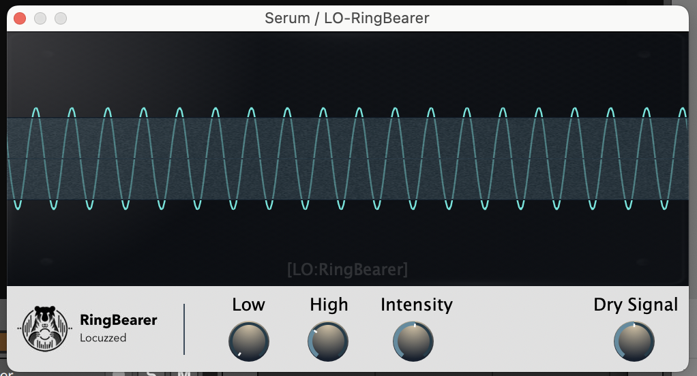

# LO-RingBearer
This plugin does RingModulation from a Sidechain Signal on the desired Amplitude-Level. This way you can apply RingModulation only near the zero-crossings, only on the maximum amplitude or wherever in between you desire. This can be useful for keeping a clean transient and only decorating the quieter area of your sound.

# Parameters
You can set the Area to be effected with the `Threshold Low` and `Threshold High` Knobs.
The part of the Waveform that where the effect is applied, is indicated by a blue, grainy overlay.
The Waveform is a Snapshot of the Audio *BEFORE* the effect gets applied.

If you hear artifacts in your sound or the harmonic relationship is changed too much, you can adjust the `Smoothing` Parameter to avoid abrupt
changes in processing.

# Requirements
You need the JUCE Framework to compile this project (https://juce.com)